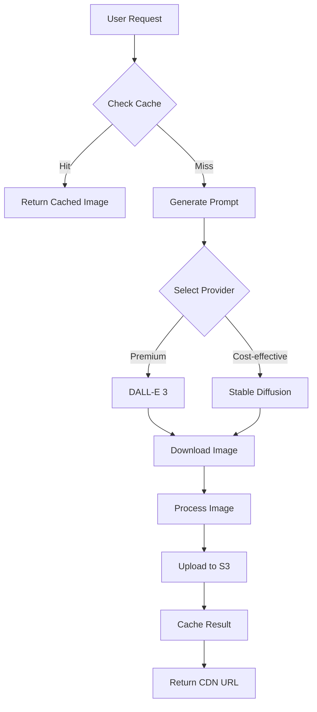

# 🤖 AI Integration Specification

**ElementaMon - Artificial Intelligence & Content Generation**

## Overview

ElementaMon leverages cutting-edge AI technologies to create dynamic, personalized gaming experiences. This document outlines the integration of various AI services for content generation, NPC interactions, and creative asset creation.

---

## 1. AI Services & Providers

### Primary AI Stack

| Service              | Provider        | Use Case                                     | Cost Model                                |
| -------------------- | --------------- | -------------------------------------------- | ----------------------------------------- |
| **GPT-4 Turbo**      | OpenAI          | NPC dialogue, quest generation, storytelling | $10/1M input tokens, $30/1M output tokens |
| **DALL-E 3**         | OpenAI          | Pet sprites, card artwork, backgrounds       | $0.04/image (1024x1024)                   |
| **ElevenLabs**       | ElevenLabs      | Premium voice synthesis, character voices    | $0.30/1K characters                       |
| **Azure Speech**     | Microsoft       | Cost-effective TTS/STT                       | $4/1M characters                          |
| **Whisper**          | OpenAI          | Speech-to-text for voice commands            | $0.006/minute                             |
| **Stable Diffusion** | Replicate/Local | Open-source image generation                 | Variable/Self-hosted                      |
| **Claude**           | Anthropic       | Alternative LLM for content                  | $3/1M input tokens, $15/1M output tokens  |
| **Moderation API**   | OpenAI          | Content filtering                            | $0.002/1K tokens                          |

### Cost Management Strategy

**Monthly Budget Tiers:**

```typescript
const AI_BUDGET_TIERS = {
  development: 500, // $500/month for dev/staging
  production_small: 2000, // $2K/month for <10K users
  production_medium: 10000, // $10K/month for <100K users
  production_large: 50000, // $50K/month for 100K+ users
};
```

**Cost Optimization:**

- Redis caching (70% cache hit rate target)
- Batch processing for non-urgent requests
- Fallback to cheaper alternatives (Azure Speech vs ElevenLabs)
- User tier-based feature access (free vs premium AI features)
- Rate limiting per user/session

---

## 2. NPC Dialogue Generation

### Use Cases

**Dynamic NPCs:**

- Quest givers with contextual dialogue
- Shop keepers with personality
- Tutorial guides
- Random encounter NPCs
- Story-driven characters

**Battle Commentary:**

- Real-time battle narration
- Victory/defeat messages
- Pet evolution celebrations

### Implementation

```typescript
interface NPCDialogueRequest {
  npcId: string;
  sceneId: string;
  context: {
    playerName: string;
    playerLevel: number;
    currentQuest?: string;
    location: string;
    timeOfDay: 'morning' | 'afternoon' | 'evening' | 'night';
    playerMood?: 'friendly' | 'aggressive' | 'neutral';
    previousInteractions?: string[];
  };
  maxTokens?: number;
  temperature?: number;
}

interface NPCDialogueResponse {
  npcId: string;
  dialogue: string;
  emotion: 'happy' | 'sad' | 'angry' | 'neutral' | 'excited';
  voiceId: string;
  audioUrl?: string;
  cacheKey: string;
  generatedAt: Date;
}
```

### NPC Personality Profiles

```typescript
const NPC_PERSONALITIES = {
  questGiver: {
    traits: ['helpful', 'wise', 'encouraging'],
    speakingStyle: 'formal but friendly',
    topics: ['quests', 'lore', 'guidance'],
  },
  shopKeeper: {
    traits: ['enthusiastic', 'sales-focused', 'knowledgeable'],
    speakingStyle: 'casual and energetic',
    topics: ['items', 'prices', 'deals'],
  },
  rival: {
    traits: ['competitive', 'confident', 'teasing'],
    speakingStyle: 'cocky but respectful',
    topics: ['battles', 'challenges', 'pets'],
  },
  mentor: {
    traits: ['patient', 'knowledgeable', 'supportive'],
    speakingStyle: 'calm and instructive',
    topics: ['strategy', 'training', 'pet care'],
  },
};
```

### Dialogue Generation Service

```typescript
import { OpenAI } from 'openai';
import { Injectable } from '@nestjs/common';

@Injectable()
export class NPCDialogueService {
  private openai: OpenAI;

  constructor(
    private redis: RedisService,
    private costTracker: AICostTrackerService,
    private voiceService: VoiceSynthesisService
  ) {
    this.openai = new OpenAI({
      apiKey: process.env.OPENAI_API_KEY,
    });
  }

  async generateDialogue(request: NPCDialogueRequest): Promise<NPCDialogueResponse> {
    // Check cache first
    const cacheKey = this.generateCacheKey(request);
    const cached = await this.redis.get(cacheKey);

    if (cached) {
      this.costTracker.incrementCacheHit('dialogue');
      return JSON.parse(cached);
    }

    // Get NPC profile
    const npc = await this.getNPCProfile(request.npcId);
    const personality = NPC_PERSONALITIES[npc.type];

    // Build context-aware prompt
    const systemPrompt = this.buildSystemPrompt(npc, personality);
    const userPrompt = this.buildUserPrompt(request, npc);

    // Generate dialogue
    const completion = await this.openai.chat.completions.create({
      model: 'gpt-4-turbo-preview',
      messages: [
        { role: 'system', content: systemPrompt },
        { role: 'user', content: userPrompt },
      ],
      temperature: request.temperature || 0.7,
      max_tokens: request.maxTokens || 150,
      presence_penalty: 0.3,
      frequency_penalty: 0.3,
    });

    const dialogueText = completion.choices[0].message.content;
    const emotion = this.detectEmotion(dialogueText);

    // Generate voice (optional, based on settings)
    let audioUrl: string | undefined;
    if (npc.voiceEnabled) {
      audioUrl = await this.voiceService.synthesize(dialogueText, npc.voiceId);
    }

    const response: NPCDialogueResponse = {
      npcId: request.npcId,
      dialogue: dialogueText,
      emotion,
      voiceId: npc.voiceId,
      audioUrl,
      cacheKey,
      generatedAt: new Date(),
    };

    // Cache for 1 hour
    await this.redis.setex(cacheKey, 3600, JSON.stringify(response));

    // Track costs
    await this.costTracker.track({
      service: 'openai',
      operation: 'dialogue-generation',
      tokensUsed: completion.usage.total_tokens,
      estimatedCost: this.calculateGPT4Cost(completion.usage),
    });

    return response;
  }

  private buildSystemPrompt(npc: NPC, personality: Personality): string {
    return `
      You are ${npc.name}, a ${npc.role} in the world of ElementaMon.
      
      Personality traits: ${personality.traits.join(', ')}
      Speaking style: ${personality.speakingStyle}
      Topics of expertise: ${personality.topics.join(', ')}
      
      Background: ${npc.backstory}
      
      Rules:
      - Keep responses concise (2-3 sentences max)
      - Stay in character at all times
      - Be helpful and engaging
      - Use appropriate emotion and tone
      - Reference ElementaMon lore when relevant
      - Avoid breaking the fourth wall
    `.trim();
  }

  private buildUserPrompt(request: NPCDialogueRequest, npc: NPC): string {
    const ctx = request.context;
    return `
      Scene: ${request.sceneId} at ${ctx.location}
      Time: ${ctx.timeOfDay}
      Player: ${ctx.playerName} (Level ${ctx.playerLevel})
      ${ctx.currentQuest ? `Current Quest: ${ctx.currentQuest}` : ''}
      Player mood: ${ctx.playerMood || 'neutral'}
      
      Generate a natural dialogue response from ${npc.name}.
    `.trim();
  }

  private detectEmotion(text: string): Emotion {
    // Simple keyword-based emotion detection
    const emotions = {
      happy: ['great', 'wonderful', 'excellent', 'fantastic', '!'],
      excited: ['amazing', 'awesome', 'incredible', '!!'],
      sad: ['sorry', 'unfortunate', 'sad', 'regret'],
      angry: ['angry', 'furious', 'unacceptable'],
      neutral: [],
    };

    const lowerText = text.toLowerCase();

    for (const [emotion, keywords] of Object.entries(emotions)) {
      if (keywords.some((kw) => lowerText.includes(kw))) {
        return emotion as Emotion;
      }
    }

    return 'neutral';
  }

  private generateCacheKey(request: NPCDialogueRequest): string {
    // Include relevant context for cache key
    return `dialogue:${request.npcId}:${request.sceneId}:${request.context.playerLevel}`;
  }

  private calculateGPT4Cost(usage: TokenUsage): number {
    const inputCost = (usage.prompt_tokens / 1_000_000) * 10;
    const outputCost = (usage.completion_tokens / 1_000_000) * 30;
    return inputCost + outputCost;
  }
}
```

---

## 3. Image Generation

### Use Cases

**Pet Sprites:**

- Custom pet creation from player descriptions
- Evolution stage artwork
- Shiny/rare variant generation

**Card Artwork:**

- Ability card illustrations
- Pet card backgrounds
- Special edition cards

**Environment Assets:**

- Battle backgrounds
- Location scenery
- Item icons

### Image Generation Service

```typescript
import { OpenAI } from 'openai';
import { S3Client, PutObjectCommand } from '@aws-sdk/client-s3';

@Injectable()
export class ImageGenerationService {
  private openai: OpenAI;
  private s3: S3Client;

  async generatePetSprite(
    description: string,
    elementType: ElementalType,
    style: 'base' | 'evolved' | 'final' = 'base'
  ): Promise<GeneratedImage> {
    const prompt = this.buildPetPrompt(description, elementType, style);

    // Generate with DALL-E 3
    const response = await this.openai.images.generate({
      model: 'dall-e-3',
      prompt,
      n: 1,
      size: '1024x1024',
      quality: 'hd',
      style: 'vivid',
    });

    // Download image
    const imageBuffer = await this.downloadImage(response.data[0].url);

    // Process image (remove background, resize, etc.)
    const processed = await this.processImage(imageBuffer, {
      removeBackground: true,
      resize: { width: 512, height: 512 },
      format: 'webp',
    });

    // Upload to S3 with CDN
    const s3Key = `pets/${elementType}/${style}/${Date.now()}.webp`;
    await this.uploadToS3(processed, s3Key);

    const cdnUrl = `${process.env.CDN_URL}/${s3Key}`;

    // Track costs
    await this.costTracker.track({
      service: 'openai',
      operation: 'image-generation',
      imagesGenerated: 1,
      estimatedCost: 0.04,
    });

    return {
      url: cdnUrl,
      s3Key,
      elementType,
      style,
      prompt,
      generatedAt: new Date(),
    };
  }

  private buildPetPrompt(description: string, elementType: ElementalType, style: string): string {
    const styleDescriptors = {
      base: 'cute, small, youthful',
      evolved: 'more mature, stronger features, intermediate form',
      final: 'majestic, powerful, fully evolved',
    };

    const elementDescriptors = {
      Fire: 'flames, warm colors (red, orange, yellow), fiery aura',
      Water: 'water droplets, blue tones, aquatic features',
      Electric: 'lightning bolts, yellow and blue, sparks',
      Earth: 'rocks, brown and green, sturdy appearance',
      Ice: 'snowflakes, cyan and white, crystalline',
      Poison: 'purple and green, toxic aesthetic',
      Psychic: 'pink and purple, mystical aura',
      Ghost: 'ethereal, translucent, dark purple',
      Fairy: 'pastel colors, magical, sparkles',
    };

    return `
      A ${styleDescriptors[style]} elemental creature for a Pokemon-style game.
      
      Base description: ${description}
      Element type: ${elementType}
      Element visual traits: ${elementDescriptors[elementType]}
      
      Style requirements:
      - Vibrant, saturated colors
      - Friendly, appealing character design
      - Transparent background (PNG-ready)
      - Front-facing view, standing pose
      - High detail, game sprite quality
      - Suitable for all ages
      - Clean lines and clear silhouette
      
      Art style: Modern digital illustration, cel-shaded, similar to Pokemon or Neopets
    `.trim();
  }

  // Alternative: Stable Diffusion via Replicate
  async generateWithStableDiffusion(prompt: string): Promise<GeneratedImage> {
    const replicate = new Replicate({
      auth: process.env.REPLICATE_API_TOKEN,
    });

    const output = await replicate.run(
      'stability-ai/sdxl:39ed52f2a78e934b3ba6e2a89f5b1c712de7dfea535525255b1aa35c5565e08b',
      {
        input: {
          prompt,
          negative_prompt: 'ugly, blurry, low quality, nsfw',
          width: 1024,
          height: 1024,
          num_outputs: 1,
          scheduler: 'K_EULER',
          num_inference_steps: 50,
          guidance_scale: 7.5,
        },
      }
    );

    // Process and upload
    const imageUrl = output[0];
    const buffer = await this.downloadImage(imageUrl);
    const s3Key = await this.uploadToS3(buffer, `generated/${Date.now()}.png`);

    return {
      url: `${process.env.CDN_URL}/${s3Key}`,
      s3Key,
      prompt,
      model: 'stable-diffusion-xl',
      generatedAt: new Date(),
    };
  }

  private async processImage(buffer: Buffer, options: ImageProcessOptions): Promise<Buffer> {
    const sharp = require('sharp');

    let image = sharp(buffer);

    if (options.removeBackground) {
      // Use remove.bg API or similar
      buffer = await this.removeBackground(buffer);
      image = sharp(buffer);
    }

    if (options.resize) {
      image = image.resize(options.resize.width, options.resize.height);
    }

    if (options.format) {
      image = image.toFormat(options.format, { quality: 90 });
    }

    return await image.toBuffer();
  }
}
```

### Image Generation Workflow



---

## 4. Voice Synthesis & Dubbing

### Use Cases

**Character Voices:**

- NPC dialogue narration
- Battle commentary
- Tutorial instructions
- Pet sounds/cries

**Ambient Audio:**

- Story narration
- Quest descriptions
- Achievement announcements

### Voice Synthesis Service

```typescript
import { ElevenLabsClient, play } from 'elevenlabs';
import * as sdk from 'microsoft-cognitiveservices-speech-sdk';

@Injectable()
export class VoiceSynthesisService {
  private elevenlabs: ElevenLabsClient;

  constructor(
    private azure: AzureBlobService,
    private costTracker: AICostTrackerService,
    private redis: RedisService
  ) {
    this.elevenlabs = new ElevenLabsClient({
      apiKey: process.env.ELEVENLABS_API_KEY,
    });
  }

  async synthesizeCharacterVoice(
    text: string,
    characterId: string,
    options?: VoiceSynthesisOptions
  ): Promise<VoiceResult> {
    // Check cache
    const cacheKey = `voice:${characterId}:${this.hashText(text)}`;
    const cached = await this.redis.get(cacheKey);

    if (cached) {
      this.costTracker.incrementCacheHit('voice');
      return JSON.parse(cached);
    }

    const character = await this.getCharacter(characterId);

    // Use premium voice for important characters, Azure for others
    const result = character.isPremium
      ? await this.synthesizeWithElevenLabs(text, character)
      : await this.synthesizeWithAzure(text, character);

    // Cache for 7 days
    await this.redis.setex(cacheKey, 604800, JSON.stringify(result));

    return result;
  }

  private async synthesizeWithElevenLabs(text: string, character: Character): Promise<VoiceResult> {
    const audio = await this.elevenlabs.textToSpeech.convert({
      voice_id: character.voiceId,
      text: text,
      model_id: 'eleven_multilingual_v2',
      voice_settings: {
        stability: 0.5,
        similarity_boost: 0.75,
        style: character.voiceStyle || 0.5,
        use_speaker_boost: true,
      },
      output_format: 'mp3_44100_128',
    });

    // Upload to Azure Blob Storage
    const blobName = `voices/${character.id}/${Date.now()}.mp3`;
    const url = await this.azure.uploadAudio(audio, blobName);

    const duration = await this.calculateAudioDuration(audio);

    // Track costs (ElevenLabs: $0.30 per 1K characters)
    const cost = (text.length / 1000) * 0.3;
    await this.costTracker.track({
      service: 'elevenlabs',
      operation: 'tts',
      audioMinutes: duration / 60,
      estimatedCost: cost,
    });

    return {
      url,
      characterId: character.id,
      text,
      duration,
      format: 'mp3',
      provider: 'elevenlabs',
      generatedAt: new Date(),
    };
  }

  private async synthesizeWithAzure(text: string, character: Character): Promise<VoiceResult> {
    const speechConfig = sdk.SpeechConfig.fromSubscription(
      process.env.AZURE_SPEECH_KEY,
      process.env.AZURE_SPEECH_REGION
    );

    // Map character to Azure voice
    const voiceName = this.getAzureVoice(character);
    speechConfig.speechSynthesisVoiceName = voiceName;

    const audioConfig = sdk.AudioConfig.fromDefaultSpeakerOutput();
    const synthesizer = new sdk.SpeechSynthesizer(speechConfig, audioConfig);

    return new Promise((resolve, reject) => {
      synthesizer.speakTextAsync(
        text,
        async (result) => {
          if (result.reason === sdk.ResultReason.SynthesizingAudioCompleted) {
            // Upload to Azure Blob
            const blobName = `voices/${character.id}/${Date.now()}.mp3`;
            const url = await this.azure.uploadBuffer(Buffer.from(result.audioData), blobName);

            // Azure costs: $4 per 1M characters
            const cost = (text.length / 1_000_000) * 4;
            await this.costTracker.track({
              service: 'azure',
              operation: 'tts',
              estimatedCost: cost,
            });

            resolve({
              url,
              characterId: character.id,
              text,
              duration: result.audioDuration / 10_000_000, // Convert to seconds
              format: 'mp3',
              provider: 'azure',
              generatedAt: new Date(),
            });
          } else {
            reject(result.errorDetails);
          }

          synthesizer.close();
        },
        (error) => {
          synthesizer.close();
          reject(error);
        }
      );
    });
  }

  // Voice cloning for custom characters (premium feature)
  async cloneVoice(audioSamples: Buffer[], characterName: string): Promise<VoiceCloneResult> {
    // Requires 1-3 minutes of clean audio
    const clonedVoice = await this.elevenlabs.voices.add({
      name: characterName,
      files: audioSamples,
      description: `Custom voice for ${characterName}`,
    });

    return {
      voiceId: clonedVoice.voice_id,
      name: characterName,
      createdAt: new Date(),
    };
  }

  // Speech-to-text for voice commands
  async transcribe(audioBuffer: Buffer): Promise<TranscriptionResult> {
    const formData = new FormData();
    formData.append('file', audioBuffer, 'audio.mp3');
    formData.append('model', 'whisper-1');

    const transcription = await this.openai.audio.transcriptions.create({
      file: audioBuffer,
      model: 'whisper-1',
      language: 'en',
      response_format: 'json',
    });

    return {
      text: transcription.text,
      language: 'en',
      confidence: 0.95, // Whisper doesn't provide this, but accuracy is typically high
      duration: await this.calculateAudioDuration(audioBuffer),
    };
  }
}
```

### Character Voice Library

```typescript
const CHARACTER_VOICES = {
  // Premium voices (ElevenLabs)
  mainProtagonist: {
    voiceId: 'EXAVITQu4vr4xnSDxMaL', // Sarah
    provider: 'elevenlabs',
    style: 0.6,
    isPremium: true,
  },
  mainRival: {
    voiceId: 'ErXwobaYiN019PkySvjV', // Antoni
    provider: 'elevenlabs',
    style: 0.7,
    isPremium: true,
  },

  // Cost-effective voices (Azure)
  shopKeeper: {
    voiceName: 'en-US-JennyNeural',
    provider: 'azure',
    isPremium: false,
  },
  questGiver: {
    voiceName: 'en-US-GuyNeural',
    provider: 'azure',
    isPremium: false,
  },

  // Pet sounds (synthesized)
  petFire: {
    soundEffect: 'roar-warm',
    provider: 'generated',
  },
};
```

---

## 5. Content Moderation

### Moderation Service

```typescript
@Injectable()
export class ContentModerationService {
  async moderateText(content: string, context?: ModerationContext): Promise<ModerationResult> {
    // OpenAI Moderation API
    const moderation = await this.openai.moderations.create({
      input: content,
    });

    const result = moderation.results[0];

    // Log for audit
    await this.auditLog.create({
      content,
      flagged: result.flagged,
      categories: result.categories,
      userId: context?.userId,
      timestamp: new Date(),
    });

    // Take action if needed
    if (result.flagged) {
      await this.handleViolation(content, result, context);
    }

    return {
      allowed: !result.flagged,
      flagged: result.flagged,
      categories: {
        hate: result.categories.hate,
        harassment: result.categories.harassment,
        selfHarm: result.categories['self-harm'],
        sexual: result.categories.sexual,
        violence: result.categories.violence,
      },
      categoryScores: result.category_scores,
      action: result.flagged ? 'block' : 'allow',
      reason: this.getModerationReason(result),
    };
  }

  private async handleViolation(
    content: string,
    result: any,
    context?: ModerationContext
  ): Promise<void> {
    // Notify admins
    await this.alertService.notify({
      type: 'content_violation',
      userId: context?.userId,
      content: content.substring(0, 100),
      categories: Object.keys(result.categories).filter((k) => result.categories[k]),
    });

    // Auto-moderate if score is very high
    if (Object.values(result.category_scores).some((score: any) => score > 0.8)) {
      await this.userService.tempSuspend(context?.userId, '24h', 'auto-moderation');
    }
  }
}
```

---

## 6. Cost Management & Monitoring

### Budget Tracking Dashboard

```typescript
interface AICostDashboard {
  daily: {
    openai: number;
    elevenlabs: number;
    azure: number;
    total: number;
  };
  monthly: {
    openai: number;
    elevenlabs: number;
    azure: number;
    total: number;
    budget: number;
    remaining: number;
  };
  topOperations: Array<{
    operation: string;
    count: number;
    cost: number;
  }>;
  cacheHitRate: number;
}

@Injectable()
export class AICostDashboardService {
  async getDashboard(): Promise<AICostDashboard> {
    const today = new Date();
    today.setHours(0, 0, 0, 0);

    const thisMonth = new Date(today.getFullYear(), today.getMonth(), 1);

    const [dailyStats, monthlyStats, topOps, cacheStats] = await Promise.all([
      this.getStats(today, new Date()),
      this.getStats(thisMonth, new Date()),
      this.getTopOperations(thisMonth),
      this.getCacheStats(thisMonth),
    ]);

    return {
      daily: dailyStats,
      monthly: {
        ...monthlyStats,
        budget: this.getCurrentBudget(),
        remaining: this.getCurrentBudget() - monthlyStats.total,
      },
      topOperations: topOps,
      cacheHitRate: cacheStats.hitRate,
    };
  }

  async alertIfOverBudget(): Promise<void> {
    const dashboard = await this.getDashboard();

    if (dashboard.monthly.total > dashboard.monthly.budget * 0.8) {
      await this.alertService.notify({
        type: 'budget_warning',
        message: `AI costs at ${((dashboard.monthly.total / dashboard.monthly.budget) * 100).toFixed(1)}% of monthly budget`,
        severity: 'high',
      });
    }

    if (dashboard.monthly.total > dashboard.monthly.budget) {
      await this.alertService.notify({
        type: 'budget_exceeded',
        message: `AI costs exceeded monthly budget by $${(dashboard.monthly.total - dashboard.monthly.budget).toFixed(2)}`,
        severity: 'critical',
      });

      // Enable stricter rate limiting
      await this.enableEmergencyRateLimiting();
    }
  }
}
```

---

## 7. Testing Strategy

### Unit Tests

```typescript
describe('NPCDialogueService', () => {
  it('should generate contextual dialogue', async () => {
    const request: NPCDialogueRequest = {
      npcId: 'quest-giver-1',
      sceneId: 'town-square',
      context: {
        playerName: 'Ash',
        playerLevel: 5,
        location: 'Starter Town',
        timeOfDay: 'morning',
      },
    };

    const result = await service.generateDialogue(request);

    expect(result.dialogue).toBeTruthy();
    expect(result.emotion).toBeOneOf(['happy', 'neutral', 'excited']);
    expect(result.npcId).toBe('quest-giver-1');
  });

  it('should use cache when available', async () => {
    const request = {
      /* ... */
    };

    // First call
    await service.generateDialogue(request);

    // Second call (should hit cache)
    const cachedResult = await service.generateDialogue(request);

    expect(mockOpenAI.chat.completions.create).toHaveBeenCalledTimes(1);
  });
});
```

### Integration Tests

```typescript
describe('AI Service Integration', () => {
  it('should generate pet sprite and upload to S3', async () => {
    const result = await imageService.generatePetSprite('A small fire lizard', 'Fire', 'base');

    expect(result.url).toMatch(/^https:\/\/cdn/);
    expect(result.elementType).toBe('Fire');

    // Verify S3 upload
    const exists = await s3Service.objectExists(result.s3Key);
    expect(exists).toBe(true);
  });
});
```

---

## 8. Best Practices

### Prompt Engineering

**Good Prompts:**

- Clear and specific
- Include context and constraints
- Define style and tone
- Specify output format
- Include examples when helpful

**Example:**

```typescript
const goodPrompt = `
  Generate a quest for a level 10 player in the Fire Temple region.
  
  Requirements:
  - Quest title (max 50 characters)
  - Description (2-3 sentences)
  - 3-5 objectives
  - Appropriate rewards (gold, items, experience)
  - Difficulty: Medium
  - Style: Fantasy adventure, family-friendly
  
  Format: JSON
  
  Example:
  {
    "title": "The Flame Guardian's Challenge",
    "description": "...",
    "objectives": ["..."],
    "rewards": {...}
  }
`;
```

### Caching Strategy

1. **Cache frequently requested content** (NPC dialogue, common quests)
2. **Use appropriate TTL** (voices: 7 days, dialogue: 1 hour)
3. **Implement cache warming** for popular NPCs
4. **Monitor cache hit rates** (target: >70%)

### Rate Limiting

```typescript
const RATE_LIMITS = {
  free: {
    dialogue: { calls: 50, window: '1h' },
    images: { calls: 5, window: '1d' },
    voice: { calls: 20, window: '1h' },
  },
  premium: {
    dialogue: { calls: 500, window: '1h' },
    images: { calls: 50, window: '1d' },
    voice: { calls: 200, window: '1h' },
  },
};
```

---

## 9. Security & Privacy

### Data Handling

- **Never log sensitive user data** in AI requests
- **Sanitize inputs** before sending to AI APIs
- **Encrypt API keys** using Azure Key Vault
- **Rotate keys** regularly
- **Audit all AI interactions**

### Content Filtering

- **Pre-filter** user inputs before AI processing
- **Post-filter** AI outputs before displaying
- **Moderate** user-generated content immediately
- **Log violations** for review

---

## 10. Future Enhancements

### Planned Features

1. **Real-time Voice Chat**: Player voice chat with real-time translation
2. **Custom Pet Designer**: AI-assisted pet creation tool
3. **Dynamic Storytelling**: Branching narratives that adapt to player choices
4. **AI Dungeon Master**: Procedural quest generation with AI narration
5. **Emotion Recognition**: Analyze player sentiment for adaptive difficulty
6. **Music Generation**: AI-composed battle themes and ambient music
7. **Advanced NPCs**: Memory-enabled NPCs that remember past interactions

### Research & Development

- Exploring **GPT-4 Vision** for analyzing player strategies
- Testing **fine-tuned models** for game-specific content
- Investigating **local AI deployment** to reduce costs
- Experimenting with **voice activity detection** for commands

---

## 11. Summary

ElementaMon leverages AI to create a dynamic, personalized gaming experience:

- **8 AI providers** integrated for different use cases
- **Cost-optimized** with caching and tiered access
- **Comprehensive testing** with TDD approach
- **Monitored** with Application Insights
- **Secure** with content moderation and data privacy
- **Scalable** architecture ready for millions of users

**Estimated Monthly AI Costs:**

- Small (10K users): ~$2,000
- Medium (100K users): ~$10,000
- Large (1M users): ~$50,000

_With 70% cache hit rate and optimized workflows._

---

**For implementation details, see README.md and related service documentation.**
